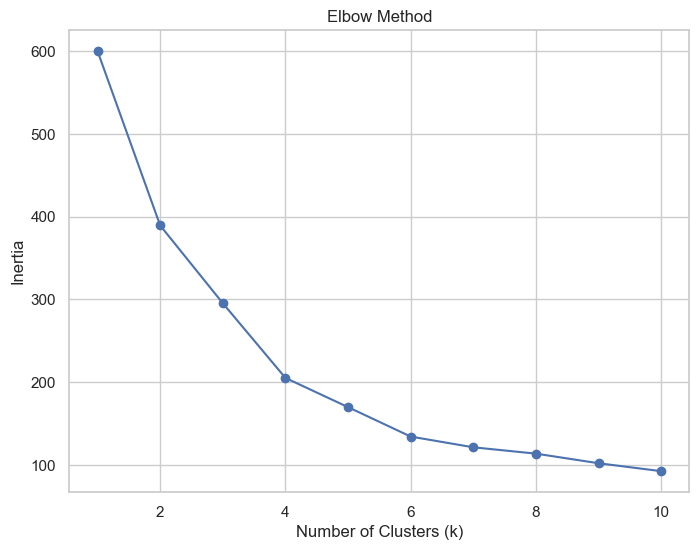
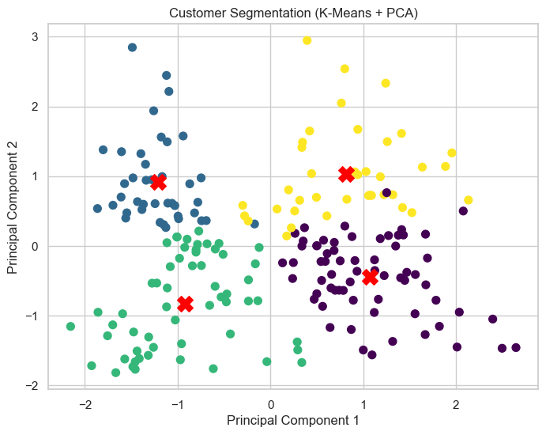

# 🛍 Customer Segmentation using K-Means Clustering

## 📌 Project Overview

This project applies **unsupervised learning (K-Means clustering)** to segment mall customers based on behavioral patterns.

The objective is to:
- Identify meaningful customer groups
- Understand spending behavior
- Provide actionable business insights

---

## 📊 Dataset

Mall Customers Dataset (200 entries)

Features used:
- Age
- Annual Income (k$)
- Spending Score (1–100)

Dropped:
- CustomerID (non-informative)
- Gender (excluded for behavioral focus)

---

## ⚙️ Approach

### 1️⃣ Exploratory Data Analysis
- Analyzed feature distributions
- Examined correlation between age, income, and spending
- Observed moderate negative correlation between age and spending

### 2️⃣ Feature Scaling
K-Means uses Euclidean distance, so features were scaled using `StandardScaler`.

### 3️⃣ Optimal Cluster Selection
- Elbow Method used (k = 1 to 10)
- Silhouette Score used for validation

Results:
- k = 4 → Silhouette ≈ 0.404
- k = 6 → Silhouette ≈ 0.431

Although k = 6 showed slightly higher separation,
k = 4 provided clearer and more interpretable customer segments.

Final Model: **k = 4**

---

## 📈 Elbow Method

---

## 📊 Cluster Visualization (PCA Projection)

---

## 🧠 Cluster Interpretation

### Cluster 0
Older customers, moderate income, low spending.

### Cluster 1
Young, high income, high spending.
Premium segment.

### Cluster 2
Young, lower income, moderate spending.

### Cluster 3
Middle-aged, high income, low spending.
Untapped potential segment.

---

## 📌 Key Insights

- Spending behavior is not strictly income-driven.
- High-income low-spending customers represent growth opportunity.
- Young high-income customers are the most valuable segment.
- Over-segmentation reduces business interpretability.

---

## 🛠 Tech Stack

- Python
- Pandas
- NumPy
- Matplotlib
- Seaborn
- Scikit-learn
- K-Means
- PCA

---

## 🚀 Conclusion

K-Means clustering successfully identified four meaningful customer segments.

This project demonstrates:
- Unsupervised learning workflow
- Cluster validation using Elbow & Silhouette methods
- Business-driven interpretation of clustering results
